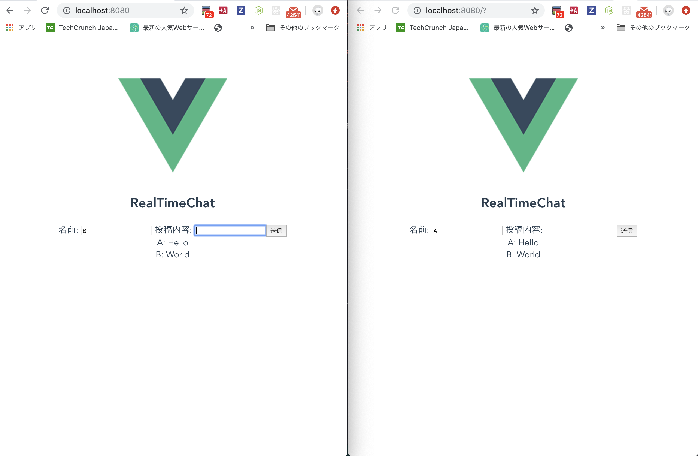

# vue websocket test
this is repository to test websocket in Vue



## backend

```bash
cd backend
npm install
node app.js
```


## frontend

```bash
cd frontend
npm install
npm run serve
```

open `localhost:8080` in chrome
